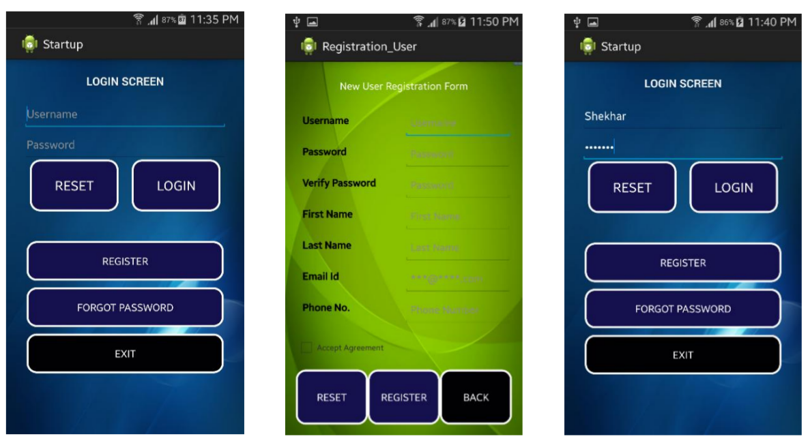
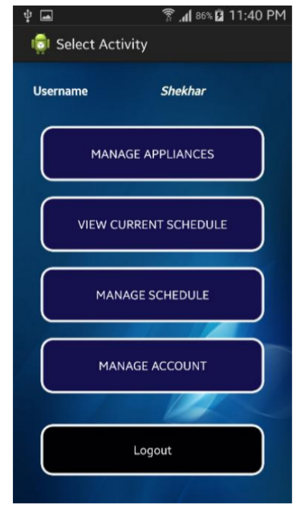
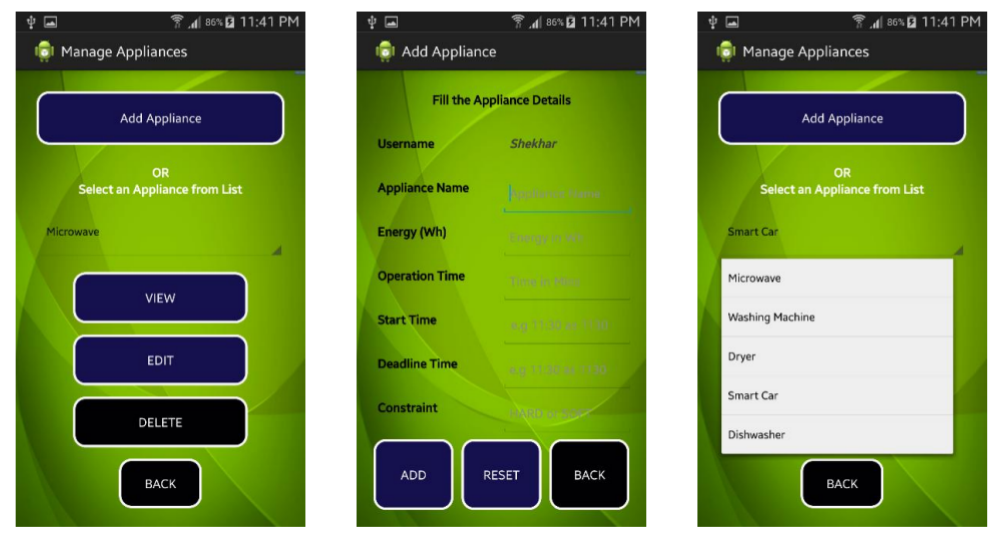
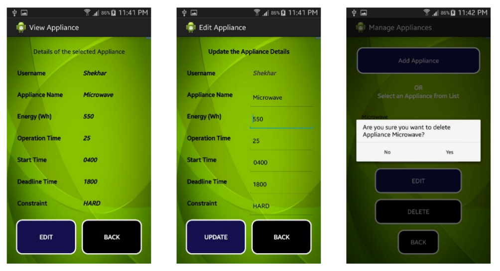
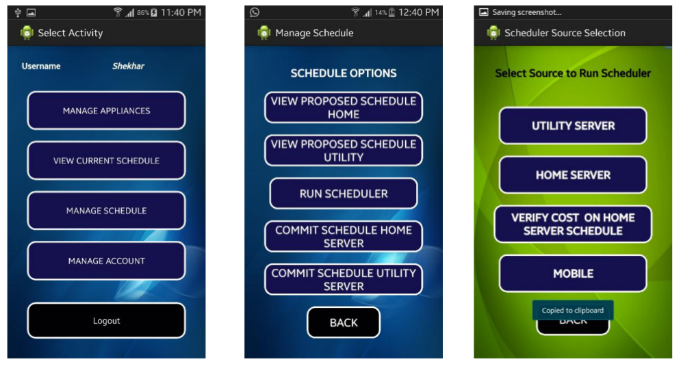
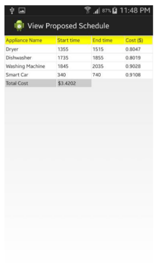
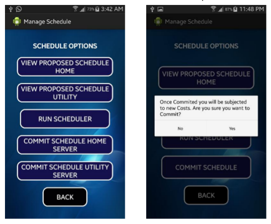
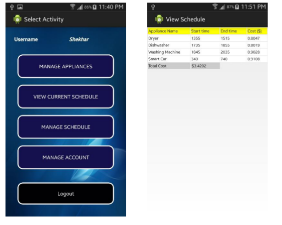

# SMART APPLIANCES SCHEDULING FOR SMART GRID
This is a Proof of Concept for a Class project.
## Introduction
With the advent of Smart Appliances and smart grids, it is safe to say, that the new paradigm will be
to schedule our Appliances in advance with reference to the Smart Grid’s day look ahead prices. This
will help, in not only reducing the total cost of the electricity bill, but will also help the Electricity
supplier to effectively plan and reduce his additional consumption from the main grid. The user
(House) can enjoy the benefits of the already implemented schedule, as he will be charged the same
price as per his committed schedule, till he decides to change the schedule again. This
implementation will allow multiple Houses connected to common Utility server and respective
Home Servers to schedule their appliances according to their own requirement.
## Architecture
* The user has the schedule accessible on his Mobile via an application, which will enable him to remotely login and either check his current schedule or request a new schedule. The user via his mobile app has the option to either view the current schedule or request for a new
schedule.
* He has the option to either query the new Schedule from the Home server or from Utility server. Once he receives a schedule from Home server, he can verify the cost of the schedule by
verifying the values from the Utility server.
* The Utility server will send back the schedule with updated costs if any.

The project is divided into 3 sections:
* Mobile App
* Home Server
* Utility Server

# Mobile app (Android)
* The User will login to his app using his credentials, i.e. Userid and Password, if it’s the first
time, then the user can click on Register and create a new userid and password. Every House
can only have one unique userid. The process is as follows:

* Once the user is able to successfully login, he can select from various activities:

* The user should first populate his Appliances list. He can add new appliances if required, or
view an appliance by selecting the appliance from the drop down list, or he can edit the
previously entered details or he can simply delete the appliance.

* Once the appliance Database is populated, now the user should run his Scheduler for the
first time. The user has options to run the scheduler on either the Home server or the Utility
server.

* If the user selects Home server, he can view the proposed schedule by going back and
selecting ‘VIEW PROPOSED SCHEDULE HOME’.
* If the Scheduler is run from Home server, the user can select ‘VERIFY COST ON HOME
SERVER SCHEDULE’ to send the data to Utility server, which will send the updated Cost for
the Schedule.

* If the Scheduler is run from Utility, the schedule is received and the user can view it.

* Once the schedule is received, the user has option to either commit it or discard it.

* The final Schedule can be viewed from the original menu option.

## Design Considerations
* The Home server and Utility server, both have independent databases. (MySQL Database)
* Every event triggers a predefined php script. **21 PHP** scripts have been written for implementing the above project. The scripts can be found in */htdocs/*
* Both the databases are simultaneously updated, and hence there is no discrepancy of the data.
* Assumption is there is no direct communication between both the databases and the Mobile app is the only source of sending and receiving data.

